# 👥 HR Employee Analytics & Training Effectiveness

## 📌 Project Overview

This project analyzes HR employee data using PostgreSQL and SQL to uncover meaningful insights related to employee demographics, workforce distribution, employee performance, engagement, satisfaction, work-life balance, training programs, training outcomes, training costs, and employee warning indicators.

The project follows an end-to-end SQL data analytics workflow using PostgreSQL.

The HR dataset consists of employee information, organizational details, performance metrics, employee experience scores, training information, training outcomes, and training costs. SQL is used to analyze the data and answer real-world HR business questions.

The main objective of this project is to transform raw HR data into meaningful insights that can help HR teams understand workforce characteristics, employee experience, training effectiveness, training costs, and areas requiring attention.

# 🎯 Project Objectives

- Analyze total employee population.
- Understand employee distribution across departments.
- Calculate overall employee satisfaction score.
- Analyze distribution of employee performance scores.
- Compare average training costs across training programs.
- Compare employee engagement and satisfaction across departments.
- Analyze employee ratings across employee types.
- Calculate percentage distribution of training outcomes.
- Analyze workforce distribution across age groups.
- Identify departments with lower work-life balance scores.
- Rank departments based on employee satisfaction.
- Identify departments with employee ratings below company average.
- Identify training programs with highest success rate.
- Analyze training cost efficiency based on cost per successful outcome.
- Identify employees showing multiple warning indicators requiring higher HR attention.
- Generate actionable HR insights and recommendations.

# 🛠️ Tools & Technologies

| Tool / Technology | Purpose |
|---|---|
| SQL | Data analysis and business problem solving |
| PostgreSQL | Database management and SQL analysis |
| pgAdmin 4 | PostgreSQL environment |
| Excel | Dataset storage, inspection, and preparation |
| Git & GitHub | Version control and project documentation |

# 🔄 Project Workflow

```text
HR Employee Dataset
        ↓
Data Exploration
        ↓
Data Preparation
        ↓
Create PostgreSQL Table
        ↓
Load HR Data
        ↓
SQL Business Analysis
        ↓
Employee & Training KPIs
        ↓
Business Insights
        ↓
HR Attention Analysis
        ↓
Data-Driven Recommendations
```

# 1️⃣ Data Preparation

The cleaned HR dataset contains **2,845 employee records and 28 columns**.

The dataset includes information related to:

- Employee details
- Employment status
- Employee type
- Pay zone
- Employee classification
- Department
- Division
- Demographics
- Performance
- Employee ratings
- Engagement
- Satisfaction
- Work-life balance
- Training programs
- Training types
- Training outcomes
- Training duration
- Training costs

The data was prepared and reviewed before being loaded into PostgreSQL for SQL-based analysis.

# 2️⃣ Database Setup

The main PostgreSQL table used in this project is:

```text
hr_employee_data
```

The table contains **2,845 records and 28 columns**.

## Employee Information

- Employee ID
- Start Date
- Title

## Organization

- Business Unit
- Department
- Division

## Employment

- Employee Status
- Employee Type
- Employee Classification

## Compensation

- Pay Zone

## Demographics

- DOB
- Age
- State
- Gender
- Race
- Marital Status

## Performance

- Performance Score
- Current Employee Rating

## Employee Experience

- Engagement Score
- Satisfaction Score
- Work-Life Balance Score

## Training

- Training Date
- Training Program
- Training Type

## Training Results

- Training Outcome
- Training Duration

## Training Cost

- Training Cost

## Important Columns

```text
Employee ID
StartDate
Title
BusinessUnit
EmployeeStatus
EmployeeType
PayZone
EmployeeClassificationType
DepartmentType
Division
DOB
State
GenderCode
RaceDesc
MaritalDesc
Performance Score
Current Employee Rating
Survey Date
Engagement Score
Satisfaction Score
Work-Life Balance Score
Training Date
Training Program Name
Training Type
Training Outcome
Training Duration(Days)
Training Cost
Age
```

# 3️⃣ SQL Business Analysis

The project contains **15 SQL business problems**, divided into three levels:

- 🟢 Basic Level – 5 questions
- 🟡 Intermediate Level – 5 questions
- 🔴 Advanced Level – 5 questions

# 📊 Business Problems & Solutions

# 🟢 Basic Level

## Q1. Total Number of Employees

### 📝 SQL Problem

Find the total number of employees present in the HR dataset.

### 💻 Solution Query

```sql
SELECT
    COUNT(*) AS total_employees
FROM hr_employee_data;
```

### 📤 Output

The query returns the total number of employees in the dataset.

### 🖼️ Output Screenshot

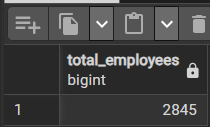

### 💡 Insight

The organization has **2,845 employees** in the analyzed dataset. This provides the baseline workforce population for the remaining HR analyses.

---

## Q2. Employees by Department

### 📝 SQL Problem

Find the total number of employees in each department.

### 💻 Solution Query

```sql
SELECT
    department_type,
    COUNT(*) AS total_employees
FROM hr_employee_data
GROUP BY department_type
ORDER BY total_employees DESC;
```

### 📤 Output

The query returns the number of employees in each department, ordered from highest to lowest.

### 🖼️ Output Screenshot

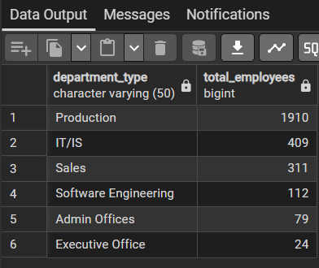

### 💡 Insight

**Production** is the largest department with **1,910 employees**, followed by **IT/IS with 409** and **Sales with 311**. Software Engineering has 112 employees, while Admin Offices and Executive Office have 79 and 24 employees respectively.

---

## Q3. Overall Average Employee Satisfaction

### 📝 SQL Problem

Calculate the overall average employee satisfaction score.

### 💻 Solution Query

```sql
SELECT
    ROUND(AVG(satisfaction_score), 2) AS avg_satisfaction_score
FROM hr_employee_data;
```

### 📤 Output

The query returns an overall average satisfaction score of:

```text
3.03
```

### 🖼️ Output Screenshot

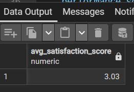

### 💡 Insight

The overall average employee satisfaction score is **3.03**. This provides a baseline against which department-level satisfaction can be compared.

---

## Q4. Employee Performance Score Distribution

### 📝 SQL Problem

Find the number of employees in each performance score category.

### 💻 Solution Query

```sql
SELECT
    performance_score,
    COUNT(*) AS total_employees
FROM hr_employee_data
GROUP BY performance_score
ORDER BY total_employees DESC;
```

### 📤 Output

The query returns the employee count for each performance category.

### 🖼️ Output Screenshot


### 💡 Insight

The majority of employees, **2,251**, fall under **Fully Meets**. A further **346 employees** are categorized as Exceeds, while 162 are in Needs Improvement and 86 are in PIP. The distribution is therefore concentrated in the Fully Meets category.

---

## Q5. Average Training Cost by Training Program

### 📝 SQL Problem

Calculate the average training cost for each training program.

### 💻 Solution Query

```sql
SELECT
    training_program_name,
    ROUND(AVG(training_cost), 2) AS avg_training_cost
FROM hr_employee_data
GROUP BY training_program_name
ORDER BY avg_training_cost DESC;
```

### 📤 Output

The query returns the average training cost for each training program.

### 🖼️ Output Screenshot

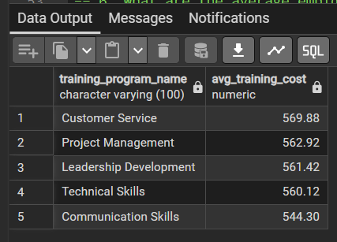

### 💡 Insight

**Customer Service** has the highest average training cost at approximately **$569.88**, followed by Project Management at **$562.92** and Leadership Development at **$561.42**. Communication Skills has the lowest average cost at approximately **$544.30**.

# 🟡 Intermediate Level

## Q6. Engagement and Satisfaction by Department

### 📝 SQL Problem

Calculate the average employee engagement and satisfaction scores for each department.

### 💻 Solution Query

```sql
SELECT
    department_type,
    ROUND(AVG(engagement_score), 2) AS avg_engagement,
    ROUND(AVG(satisfaction_score), 2) AS avg_satisfaction
FROM hr_employee_data
GROUP BY department_type;
```

### 📤 Output

The query returns the average engagement and satisfaction scores for each department.

### 🖼️ Output Screenshot

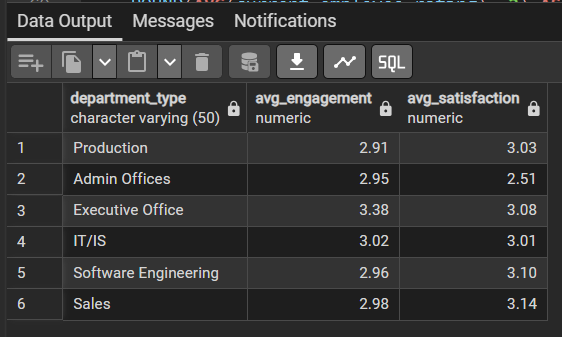

### 💡 Insight

**Executive Office** has the highest average engagement score at **3.38**, while **Sales** has the highest average satisfaction score at **3.14**. **Admin Offices** has the lowest satisfaction score at **2.51**, while Production has the lowest engagement score at **2.91** among the departments.

---

## Q7. Average Employee Rating by Employee Type

### 📝 SQL Problem

Calculate the average employee rating for each employee type.

### 💻 Solution Query

```sql
SELECT
    employee_type,
    ROUND(AVG(current_employee_rating), 2) AS avg_employee_rating
FROM hr_employee_data
GROUP BY employee_type
ORDER BY avg_employee_rating DESC;
```

### 📤 Output

The query returns the average employee rating for each employee type.

### 🖼️ Output Screenshot

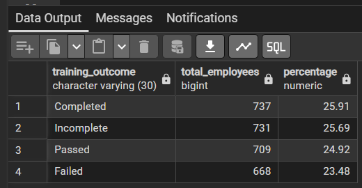

### 💡 Insight

Contract employees have the highest average employee rating at **2.99**, followed closely by Part-Time employees at **2.98**. Full-Time employees have an average rating of **2.95**.

---

## Q8. Training Outcome Distribution

### 📝 SQL Problem

Calculate the number and percentage of employees in each training outcome category.

### 💻 Solution Query

```sql
SELECT
    training_outcome,
    COUNT(*) AS total_employees,
    ROUND(
        COUNT(*) * 100.0 / SUM(COUNT(*)) OVER (),
        2
    ) AS percentage
FROM hr_employee_data
GROUP BY training_outcome
ORDER BY total_employees DESC;
```

### 📤 Output

The query returns the number and percentage of employees for each training outcome.

### 🖼️ Output Screenshot

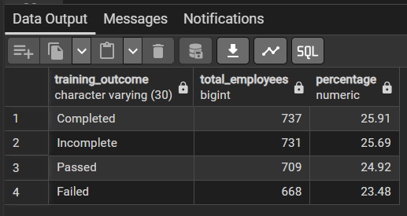

### 💡 Insight

**Completed** training represents the largest outcome category with **737 employees (25.91%)**, followed by Incomplete at **25.69%**, Passed at **24.92%**, and Failed at **23.48%**. The relatively close distribution across outcomes provides a useful basis for evaluating training effectiveness.

---

## Q9. Workforce Distribution by Age Group

### 📝 SQL Problem

Analyze the workforce distribution across different age groups.

### 💻 Solution Query

```sql
SELECT
    CASE
        WHEN age < 25 THEN 'Under 25'
        WHEN age BETWEEN 25 AND 34 THEN '25-34'
        WHEN age BETWEEN 35 AND 44 THEN '35-44'
        WHEN age BETWEEN 45 AND 54 THEN '45-54'
        ELSE '55+'
    END AS age_group,
    COUNT(*) AS total_employees
FROM hr_employee_data
GROUP BY
    CASE
        WHEN age < 25 THEN 'Under 25'
        WHEN age BETWEEN 25 AND 34 THEN '25-34'
        WHEN age BETWEEN 35 AND 44 THEN '35-44'
        WHEN age BETWEEN 45 AND 54 THEN '45-54'
        ELSE '55+'
    END
ORDER BY total_employees DESC;
```

### 📤 Output

The query returns the number of employees in each age group.

### 🖼️ Output Screenshot

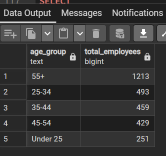

### 💡 Insight

The **55+ age group** is the largest workforce segment with **1,213 employees**. It is followed by the 25–34 group with 493 employees, the 35–44 group with 459 employees, the 45–54 group with 429 employees, and employees under 25 with 251 employees.

---

## Q10. Departments with Lower Work-Life Balance

### 📝 SQL Problem

Identify departments with lower average work-life balance scores and compare their satisfaction and engagement scores.

### 💻 Solution Query

```sql
SELECT
    department_type,
    ROUND(AVG(work_life_balance_score), 2) AS avg_work_life_balance,
    ROUND(AVG(satisfaction_score), 2) AS avg_satisfaction,
    ROUND(AVG(engagement_score), 2) AS avg_engagement
FROM hr_employee_data
GROUP BY department_type
ORDER BY avg_work_life_balance ASC;
```

### 📤 Output

The query returns department-level work-life balance, satisfaction, and engagement scores.

### 🖼️ Output Screenshot

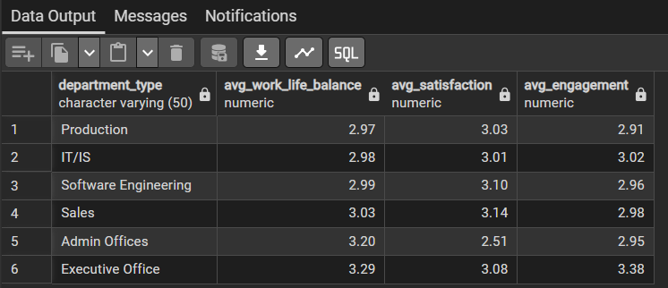

### 💡 Insight

**Production** has the lowest average work-life balance score at **2.97**, followed by IT/IS at **2.98** and Software Engineering at **2.99**. Production also has the lowest engagement score at **2.91**, while Admin Offices has the lowest satisfaction score at **2.51**.

# 🔴 Advanced Level

## Q11. Department Satisfaction Ranking

### 📝 SQL Problem

Rank departments based on their average employee satisfaction score.

### 💻 Solution Query

```sql
SELECT
    department_type,
    ROUND(AVG(satisfaction_score), 2) AS avg_satisfaction,
    RANK() OVER (
        ORDER BY AVG(satisfaction_score) DESC
    ) AS satisfaction_rank
FROM hr_employee_data
GROUP BY department_type
ORDER BY satisfaction_rank;
```

### 📤 Output

The query returns departments ranked according to their average satisfaction score.

### 🖼️ Output Screenshot

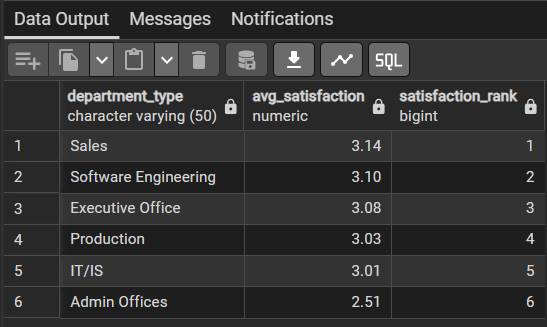

### 💡 Insight

The department-level satisfaction values range from **2.51 to 3.14**. Sales has an average satisfaction score of **3.14**, while Admin Offices records the lowest average satisfaction at **2.51**. Software Engineering and Executive Office record averages of 3.10 and 3.08 respectively.

---

## Q12. Departments Below Overall Company Rating

### 📝 SQL Problem

Identify departments whose average employee rating is below the overall company average.

### 💻 Solution Query

```sql
SELECT
    department_type,
    ROUND(AVG(current_employee_rating), 2) AS avg_department_rating,
    ROUND(
        (
            SELECT AVG(current_employee_rating)
            FROM hr_employee_data
        ),
        2
    ) AS avg_company_rating
FROM hr_employee_data
GROUP BY department_type
HAVING AVG(current_employee_rating) < (
    SELECT AVG(current_employee_rating)
    FROM hr_employee_data
)
ORDER BY avg_department_rating ASC;
```

### 📤 Output

The query returns departments whose average employee rating is below the overall company average.

### 🖼️ Output Screenshot

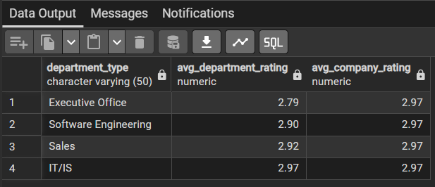

### 💡 Insight

The overall company average employee rating is **2.97**. Four departments fall below this benchmark: **Executive Office (2.79), Software Engineering (2.90), Sales (2.92), and IT/IS (2.97)**. This comparison helps identify departments whose average rating is below the organization-wide benchmark.

---

## Q13. Training Programs with Highest Success Rate

### 📝 SQL Problem

Identify the training program with the highest success rate, considering Passed and Completed outcomes as successful.

### 💻 Solution Query

```sql
WITH training_success AS (
    SELECT
        training_program_name,
        COUNT(*) AS total_trainings,
        SUM(
            CASE
                WHEN training_outcome IN ('Passed', 'Completed')
                THEN 1
                ELSE 0
            END
        ) AS successful_trainings,
        ROUND(
            SUM(
                CASE
                    WHEN training_outcome IN ('Passed', 'Completed')
                    THEN 1
                    ELSE 0
                END
            ) * 100.0 / COUNT(*),
            2
        ) AS success_rate
    FROM hr_employee_data
    GROUP BY training_program_name
)

SELECT
    training_program_name,
    total_trainings,
    successful_trainings,
    success_rate
FROM training_success
WHERE success_rate = (
    SELECT MAX(success_rate)
    FROM training_success
);
```

### 📤 Output

The query identifies the training program with the highest success rate.

### 🖼️ Output Screenshot

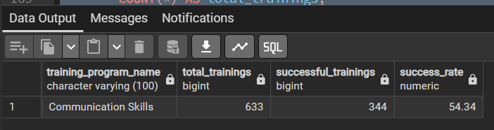

### 💡 Insight

**Communication Skills** has the highest training success rate at approximately **54.34%**, with **344 successful outcomes out of 633 training records**. Customer Service follows at approximately 53.52%, while Technical Skills has the lowest success rate at approximately 45.12%.

---

## Q14. Training Cost Efficiency

### 📝 SQL Problem

Calculate the cost per successful training outcome for each training program.

### 💻 Solution Query

```sql
SELECT
    training_program_name,
    ROUND(AVG(training_cost), 2) AS avg_training_cost,
    SUM(
        CASE
            WHEN training_outcome IN ('Passed', 'Completed')
            THEN 1
            ELSE 0
        END
    ) AS successful_trainings,
    ROUND(
        SUM(training_cost) /
        NULLIF(
            SUM(
                CASE
                    WHEN training_outcome IN ('Passed', 'Completed')
                    THEN 1
                    ELSE 0
                END
            ),
            0
        ),
        2
    ) AS cost_per_successful_outcome
FROM hr_employee_data
GROUP BY training_program_name
HAVING SUM(
    CASE
        WHEN training_outcome IN ('Passed', 'Completed')
        THEN 1
        ELSE 0
    END
) > 0
ORDER BY cost_per_successful_outcome ASC;
```

### 📤 Output

The query returns the average training cost, successful training count, and cost per successful outcome for each training program.

### 🖼️ Output Screenshot

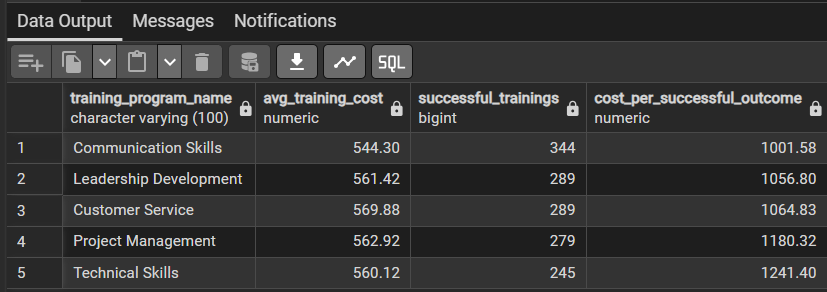

### 💡 Insight

The calculated cost per successful outcome varies across the training programs. **Communication Skills** has the lowest cost per successful outcome at approximately **$1,001.58**, while Technical Skills has the highest at approximately **$1,241.40**. Communication Skills also has the highest number of successful training outcomes at 344.

---

## Q15. Employees with Multiple Warning Indicators

### 📝 SQL Problem

Identify employees showing at least three warning indicators based on engagement, satisfaction, work-life balance, and employee rating.

### 💻 Solution Query

```sql
SELECT
    employee_id,
    title,
    department_type,
    engagement_score,
    satisfaction_score,
    work_life_balance_score,
    current_employee_rating,
    (
        CASE
            WHEN engagement_score <= 2 THEN 1
            ELSE 0
        END
        +
        CASE
            WHEN satisfaction_score <= 2 THEN 1
            ELSE 0
        END
        +
        CASE
            WHEN work_life_balance_score <= 2 THEN 1
            ELSE 0
        END
        +
        CASE
            WHEN current_employee_rating <= 2 THEN 1
            ELSE 0
        END
    ) AS warning_indicator_count
FROM hr_employee_data
WHERE
    (
        CASE
            WHEN engagement_score <= 2 THEN 1
            ELSE 0
        END
        +
        CASE
            WHEN satisfaction_score <= 2 THEN 1
            ELSE 0
        END
        +
        CASE
            WHEN work_life_balance_score <= 2 THEN 1
            ELSE 0
        END
        +
        CASE
            WHEN current_employee_rating <= 2 THEN 1
            ELSE 0
        END
    ) >= 3
ORDER BY warning_indicator_count DESC;
```

### 📤 Output

The query identifies employees with at least three warning indicators.

### 🖼️ Output Screenshot

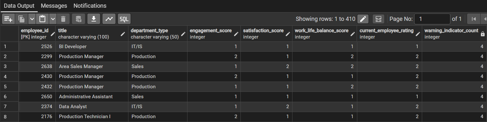

### 💡 Insight

The analysis identifies **410 employees** with at least three warning indicators. Among them, **46 employees have all four indicators**, while 364 employees have three indicators. Production accounts for the largest number of employees in this output, with **270 employees**, followed by Sales with 63 and IT/IS with 56. These indicators can help HR teams identify employees who may benefit from further review or support.

# 📈 Key Metrics

| Metric | Value |
|---|---:|
| Total Employees | 2,845 |
| Largest Department | Production |
| Production Employees | 1,910 |
| Overall Satisfaction Score | 3.03 |
| Largest Age Group | 55+ |
| Employees in 55+ Group | 1,213 |
| Highest Department Satisfaction | Sales – 3.14 |
| Lowest Department Satisfaction | Admin Offices – 2.51 |
| Lowest Work-Life Balance | Production – 2.97 |
| Lowest Engagement | Production – 2.91 |
| Highest Training Success Rate | Communication Skills – 54.34% |
| Lowest Cost per Successful Outcome | Communication Skills – $1,001.58 |
| Employees with 3+ Warning Indicators | 410 |

# 🔍 Key Business Insights

1. **Production is the largest department**, with **1,910 employees**, making workforce experience within Production particularly important to overall organizational analysis.

2. The **55+ age group is the largest workforce segment**, with **1,213 employees**, providing an important consideration for long-term workforce planning.

3. Overall employee satisfaction is **3.03**, while department-level satisfaction ranges from **2.51 to 3.14**, showing variation in employee experience across departments.

4. **Production has the lowest engagement score at 2.91 and the lowest work-life balance score at 2.97**, highlighting an area for further HR analysis.

5. **Communication Skills** has the highest training success rate at **54.34%** and the lowest calculated cost per successful outcome at approximately **$1,001.58**.

# 💡 Business Recommendations

1. Review employee experience within **Production**, particularly work-life balance and engagement, because it represents the largest department and has comparatively lower scores in these areas.

2. Investigate differences in employee satisfaction and ratings across departments to understand possible department-specific employee experience factors.

3. Evaluate training programs using both **success rate and cost per successful outcome** to understand training effectiveness and cost efficiency.

4. Use the **warning indicator analysis** as a structured HR review mechanism to identify employees who may require additional support or follow-up.

5. Consider the workforce age distribution in long-term workforce planning, especially because the **55+ age group represents the largest employee segment** in the dataset.

# 📁 Project Structure

```text
hr-employee-analytics/
│
├── data/
│   └── Cleaned_HR_Data_Analysis.xlsx
│
├── sql/
│   └── hr_employee_analysis.sql
│
├── images/
│   ├── q1_output.png
│   ├── q2_output.png
│   ├── q3_output.png
│   ├── q4_output.png
│   ├── q5_output.png
│   ├── q6_output.png
│   ├── q7_output.png
│   ├── q8_output.png
│   ├── q9_output.png
│   ├── q10_output.png
│   ├── q11_output.png
│   ├── q12_output.png
│   ├── q13_output.png
│   ├── q14_output.png
│   └── q15_output.png
│
├── README.md
│
└── Cleaned_HR_Data_Analysis.xlsx
```

# 🚀 How to Run the Project

## 1️⃣ Clone the Repository

```bash
git clone https://github.com/your-username/hr-employee-analytics.git
cd hr-employee-analytics
```

## 2️⃣ Install PostgreSQL and pgAdmin 4

Install PostgreSQL and open pgAdmin 4.

Create a new database, for example:

```text
hr_employee_analytics
```

## 3️⃣ Create the HR Table

Open:

```text
sql/hr_employee_analysis.sql
```

Create the table:

```text
hr_employee_data
```

## 4️⃣ Load the Dataset

Load:

```text
Cleaned_HR_Data_Analysis.xlsx
```

into the PostgreSQL table after preparing the dataset in the required format.

## 5️⃣ Verify the Data

Run:

```sql
SELECT * FROM hr_employee_data;

SELECT COUNT(*) 
FROM hr_employee_data;
```

Expected result:

```text
2845
```

## 6️⃣ Run the SQL Analysis

Run the SQL queries in the following order:

```text
Basic Analysis
      ↓
Intermediate Analysis
      ↓
Advanced Analysis
```

The project contains **15 business problems** covering workforce, employee experience, training effectiveness, training cost, and HR attention indicators.

# 📚 SQL Concepts Used

- SELECT
- WHERE
- GROUP BY
- ORDER BY
- HAVING
- Aggregate Functions
- COUNT()
- SUM()
- AVG()
- ROUND()
- CASE Statements
- Conditional Aggregation
- Subqueries
- Common Table Expressions (CTEs)
- Window Functions
- RANK()
- Percentage Calculations
- Employee-Level Aggregation
- Department-Level Aggregation
- Training-Level Aggregation
- Comparative Analysis
- Custom Warning Indicator Calculation
- Cost Efficiency Analysis

# 🧠 Skills Demonstrated

## Database & SQL

- PostgreSQL
- SQL Query Writing
- Database Management
- Data Aggregation
- Conditional Aggregation
- Subqueries
- CTEs
- Window Functions
- Ranking
- Grouping and Filtering
- Business Problem Solving

## Data Analysis

- Workforce Analysis
- Department Analysis
- Employee Performance Analysis
- Employee Satisfaction Analysis
- Employee Engagement Analysis
- Work-Life Balance Analysis
- Training Effectiveness Analysis
- Training Cost Analysis
- Training Outcome Analysis
- Training Cost Efficiency
- Age Distribution Analysis
- Employee Warning Indicator Analysis

## HR & Business Analysis

- HR KPI Analysis
- Workforce Planning
- Employee Experience Analysis
- Training Performance Evaluation
- Training Cost Evaluation
- Department Performance Analysis
- Employee Attention Indicators
- Data-Driven HR Insights
- Business Problem Solving

## Other

- Excel
- Git
- GitHub
- Project Documentation
- Data-Driven Decision Making

# 📌 Conclusion

This project demonstrates an end-to-end HR data analytics workflow using PostgreSQL and SQL, starting from a structured employee dataset and progressing through database preparation, SQL analysis, HR KPIs, training effectiveness analysis, business insights, and recommendations.

The analysis covers workforce distribution, employee performance, satisfaction, engagement, work-life balance, training outcomes, training costs, training efficiency, and employee warning indicators.

The project applies practical SQL concepts including aggregation, conditional logic, subqueries, CTEs, window functions, ranking, percentage calculations, comparative analysis, and cost efficiency analysis to solve real-world HR business problems.

The overall workflow demonstrates how raw HR data can be transformed into:

```text
Raw HR Data
      ↓
PostgreSQL Database
      ↓
SQL Analysis
      ↓
HR KPIs
      ↓
Employee & Training Insights
      ↓
Business Recommendations
```

This project provides practical experience in using SQL and PostgreSQL for real-world HR analytics and training effectiveness analysis.

## 👩‍💻 Author

**Tasneem Shaikh**

**Data Analytics | SQL | PostgreSQL | Python | Pandas | Power BI**
